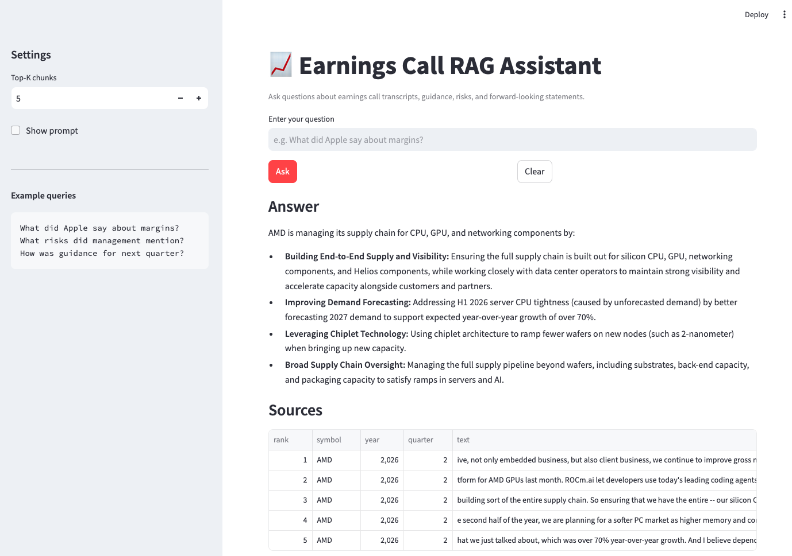
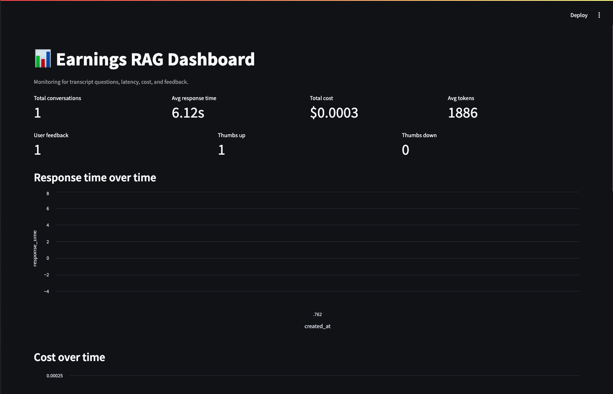

# Earnings Call RAG Assistant


A Retrieval-Augmented Generation (RAG) application for querying earnings call transcripts with natural language. The system helps users quickly find relevant management commentary on topics such as revenue, margins, guidance, risks, and strategy without manually reading long transcripts.

## Problem Description

Earnings calls are one of the most important sources of information for understanding how a public company is performing and what management expects going forward. They contain detailed discussion of financial results, operating trends, risks, and future plans, but the content is usually spread across long, dense, and unstructured transcripts.

This project addresses that problem by building a RAG assistant that indexes earnings call transcripts and allows users to ask questions in plain English. Instead of searching through full transcripts by hand, users can retrieve the most relevant context and receive a concise answer grounded in the transcript text.

The application is especially useful for investors, analysts, and researchers who want a faster and more interactive way to explore earnings-call content while still keeping the answer traceable to the original source.

## Project Goal

The goal of this project is to create an interactive assistant that:

- ingests earnings call transcripts,
- chunks and indexes the text for retrieval,
- uses hybrid search to find relevant context,
- generates grounded answers with an LLM,
- stores query and feedback data for monitoring and evaluation,
- and presents the results through a Streamlit interface.


## Ingestion Pipeline

The ingestion pipeline prepares earnings-call transcripts for hybrid retrieval and runs automatically through Kestra.

1. A Kestra scheduled flow launches the `earnings-rag-ingestion` Docker image.
2. The ingestion job selects one batch from a predefined universe of tracked tickers.
3. For each ticker, the pipeline requests the latest earnings-call transcript from the ROIC.AI API.
4. The transcript is normalized and split into overlapping chunks.
5. A SentenceTransformer model converts each chunk into a 384-dimensional embedding.
6. Each chunk, its embedding, and metadata—including ticker, year, quarter, date, and source—are stored in PostgreSQL with pgvector.
7. PostgreSQL automatically generates a weighted `text_search` value from the chunk text and metadata, enabling full-text search alongside vector search.
8. The unique `(doc_id, chunk_index)` constraint makes ingestion idempotent: rerunning the pipeline does not insert duplicate chunks.

## Retrieval Flow

1. The user enters a question in the Streamlit app.
2. The app sends the query to the RAG helper.
3. Hybrid search retrieves the most relevant transcript chunks.
4. The retrieved chunks are formatted into a prompt context.
5. Gemini generates a grounded answer using only the provided context.
6. The answer and supporting sources are displayed back to the user.
7. The interaction can be saved for later analysis and monitoring.

### High-level architecture

```text
User question → Streamlit UI → Hybrid retrieval → Prompt assembly → Gemini LLM → Answer + sources
```

## Interface

The application provides a Streamlit-based user interface with:

- a question input box,
- an Ask button to generate answers,
- a Clear button to reset the input,
- a sidebar for settings such as top-k chunks,
- and example queries to help users get started.

The interface is intentionally simple so users can focus on asking questions and reviewing grounded answers from earnings call transcripts.


## Evaluation

### Retrieval Evaluation Results

Retrieval was evaluated on 30 earnings-call questions at \(k=5\).

Two relevance levels are reported:

- **Document-level:** at least one retrieved chunk belongs to the correct earnings-call transcript.
- **Exact-chunk-level:** at least one retrieved chunk matches a labeled answer-bearing chunk, identified as `doc_id:chunk_index`.

| Approach | Document Hit Rate@5 | Exact Chunk Hit Rate@5 | Document MRR@5 | Exact Chunk MRR@5 |
|---|---:|---:|---:|---:|
| Text search (PostgreSQL full-text search) | 0.833 | 0.567 | 0.789 | 0.483 |
| Vector search (pgvector + all-MiniLM-L6-v2) | 0.700 | 0.300 | 0.667 | 0.267 |
| Hybrid search (text + vector RRF) | 0.833 | 0.567 | 0.740 | 0.418 |


### LLM-as-a-Judge Evaluation Results
The full RAG pipeline was evaluated by comparing each generated answer with a reference answer. An LLM judge classified each answer as good or bad based on factual correctness, completeness, and whether it directly answered the question.
| Metric                             | Result |
| ---------------------------------- | ------ |
| RAG answers                        | 15     |
| Judge-scored answers               | 15     |
| Good answers                       | 5      |
| Bad answers                        | 10     |
| Partial RAG answer quality         | 33.3%  |

## Monitoring

The project includes monitoring and logging features so usage can be tracked over time. Conversation records store fields such as:

- question,
- answer,
- model,
- prompt,
- token usage,
- response time,
- estimated cost,
- and timestamp.

A dashboard can display summary metrics such as:

- total conversations,
- average response time,
- total cost,
- average tokens,
- cost over time,
- response time over time,
- and recent conversations.


## Reproducibility

### Prerequisites

- Python 3.11+
- Docker Desktop with Docker Compose
- PostgreSQL with pgvector enabled
- A ROIC.AI API key for earnings-call transcript ingestion
- A Google Gemini API key for answer generation


## Technology Stack

| Component | Technology | Purpose |
|---|---|---|
| Language | Python 3.11 | Core application, ingestion, retrieval, and evaluation code |
| Frontend | Streamlit | Interactive earnings-call Q&A application and monitoring dashboard |
| LLM | Google Gemini 2.5 Flash | Generates concise, grounded answers from retrieved transcript context |
| Data source | ROIC.AI API | Retrieves earnings-call transcripts for tracked public companies |
| Orchestration | Kestra | Runs rate-limited, batch-based scheduled transcript ingestion |
| Ingestion | Python + Docker | Fetches transcripts, normalizes text, chunks content, creates embeddings, and stores results |
| Embeddings | sentence-transformers (`all-MiniLM-L6-v2`) | Converts transcript chunks and user queries into semantic vectors |
| Text search | PostgreSQL Full-Text Search | Retrieves chunks using keyword matching and ranking |
| Vector search | PostgreSQL + pgvector | Retrieves semantically similar transcript chunks using cosine distance |
| Hybrid retrieval | Reciprocal Rank Fusion (RRF) | Combines ranked text-search and vector-search results |
| Database | PostgreSQL + pgvector | Stores transcript chunks, embeddings, conversations, feedback, and monitoring metrics |
| Monitoring | Streamlit dashboard | Displays conversation history, latency, token usage, and estimated LLM cost |
| Evaluation | Python notebooks and scripts | Compares text, vector, and hybrid retrieval with Hit Rate@k and MRR |
| Containerization | Docker and Docker Compose | Runs Kestra and its supporting PostgreSQL service locally |

## Installation

```bash
git clone <https://github.com/camilleecu/Earnings-Call-Intelligence-Agent>
cd <llm_project2026>
pip install -r requirements.txt
```

Set the required environment variables before running the app.

## Usage

Start the main app:

```bash
streamlit run src/app.py
```

Start the dashboard if it is in a separate app:

```bash
streamlit run src/dashboard.py
```

## Project Structure

```text
llm_project2026/
├── .env.example                    # Environment-variable template; never commit .env
├── .gitignore
├── docker-compose.yml              # Kestra and Kestra Postgres services
├── Dockerfile.ingestion            # Docker image for scheduled transcript ingestion
├── requirements.txt                # Python dependencies
├── LICENSE
├── README.md
├── kestra_configuration.md         # Notes for configuring Kestra locally
│
├── data/
│   ├── AAPL_2026Q3.json            # Example earnings-call transcript data
│   ├── df.csv                      # Local data artifact
│   ├── rag_ground_truth.csv        # Ground truth for answer-quality evaluation
│   ├── rag_answers.csv             # Generated RAG answers
│   ├── rag_answers_partial.csv     # Intermediate RAG answer results
│   ├── rag_evaluations_partial.csv # Intermediate LLM evaluation results
│   └── retrieval_ground_truth.csv  # Ground truth for retrieval evaluation
│
├── flows/
│   └── earnings_calls_ingest.yaml  # Kestra flow for batch transcript ingestion
│
├── sql/
│   ├── 01_init_db.sql              # Creates Postgres/pgvector database schema
│   └── 02_migrate_text_search.sql  # Adds full-text-search support
│
├── src/
│   ├── __init__.py
│   ├── app.py                      # Main Streamlit RAG application
│   ├── dashboard.py                # Streamlit monitoring dashboard
│   ├── data_ingestion.py           # Fetches, chunks, embeds, and stores transcripts
│   ├── scheduled_ingestion.py      # Batch-based, rate-limited transcript ingestion
│   ├── index.py                    # Text, vector, and RRF hybrid retrieval
│   ├── rag_helper_project.py       # RAG prompt construction and Gemini answer generation
│   ├── db_init.py                  # Database initialization helpers
│   ├── db_query.py                 # Reads saved conversations and monitoring data
│   ├── db_save.py                  # Saves conversations and feedback to Postgres
│   ├── evaluate_retrieval.py       # Hit Rate and MRR evaluation for retrieval methods
│   └── rag_evaluation.py           # Evaluation of generated RAG answers
│
└── test_notebooks/
    ├── test_data_ingestion.ipynb   # Ingestion experiments and checks
    ├── test_retrieval.ipynb        # Manual retrieval tests
    ├── retrieval_evaluation.ipynb  # Text vs. vector vs. hybrid retrieval evaluation
    └── llm_evaluation.ipynb        # LLM/RAG answer evaluation
```

## Limitations

This project is a draft implementation and may still have limitations such as:

- incomplete transcript coverage,
- dependence on retrieval quality,
- limited evaluation data,
- and possible formatting differences across transcript sources.

The final version should document these limitations clearly.

## Future Work

Potential next steps include:

- improving retrieval with better chunking or reranking,
- adding filters for ticker, year, and quarter,
- expanding evaluation metrics,
- improving citation display in the UI,
- and refining monitoring dashboards.

## License

To be added.

## Acknowledgments

This project is inspired by the LLM Zoomcamp style of RAG applications and by the need to make long-form financial disclosures easier to explore.
